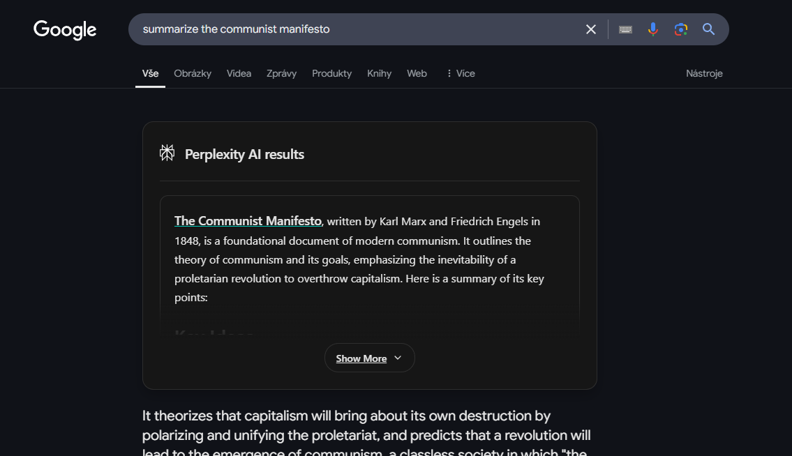

# Perplexity AI for Google Search

**Enhance your Google searches with AI-powered answers from Perplexity, right in your browser.**

This Chrome extension seamlessly integrates Perplexity AI into your Google search experience. Get concise, AI-generated answers and summaries displayed directly above your regular search results, saving you time and effort.



## Installation

1. **Clone the repository:**
    ```bash
    git clone [repository URL]
    ```
2. **Open Chrome Extensions:** Go to `chrome://extensions/` in your browser.
3. **Enable Developer Mode:** Toggle the "Developer mode" switch in the top right corner.
4. **Load unpacked:** Click the "Load unpacked" button and select the extension's repository folder.

## Usage

1. **Search on Google:** Simply perform a search on Google as you normally would.
2. **View Perplexity Results:** If relevant, Perplexity AI results will automatically appear at the top of the search results page, providing you with quick, informative answers.

## Contributing

We welcome contributions to make this extension even better!

1. **Fork the repository:** Click the "Fork" button on the top right of this repository page.
2. **Make your changes:** Implement your desired features or bug fixes.
3. **Create a pull request:** Submit a pull request with a clear description of your changes.

## License

This project is licensed under the MIT License. See the `LICENSE` file for complete details.

### Contributors

[Your Name/GitHub Username] - _Primary Developer_

We appreciate contributions from the community!

## Acknowledgements

-   **[Perplexity AI](https://www.perplexity.ai/)**: For providing the powerful AI search engine that powers this extension.
-   **[Google](https://www.google.com/)**: For the ubiquitous search engine that we enhance.
-   **[Google Chrome](https://www.google.com/chrome/)**: For the browser platform that makes this extension possible.
