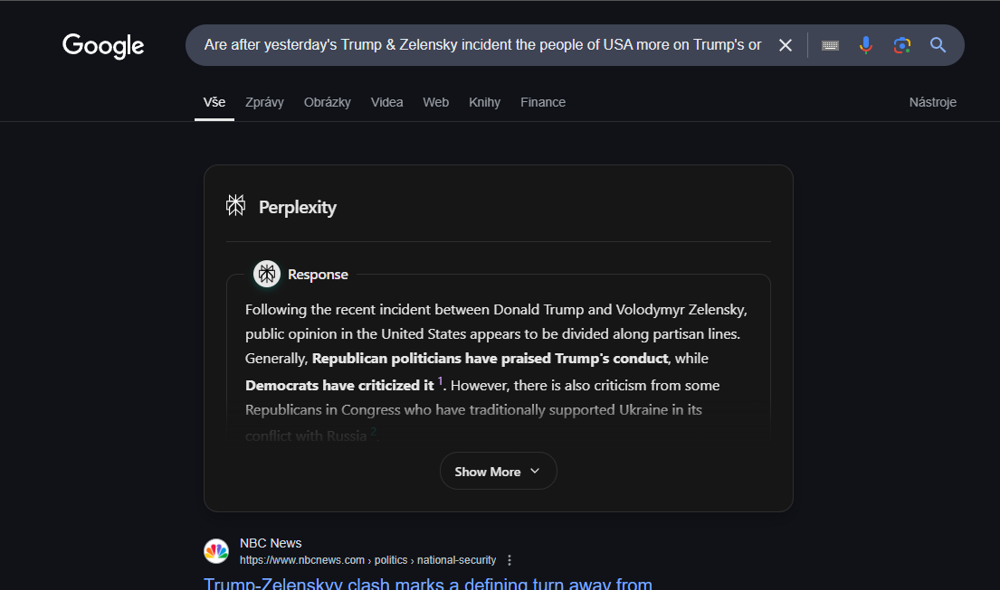

# 🔍 Perplexity AI for Google Search

<div align="center">



Enhance your Google searches with AI-powered answers from Perplexity, seamlessly integrated into your browser.  
**No API key needed!**

[Installation](#installation) • [Usage](#usage) • [Contributing](#contributing) • [License](#license)

[](https://opensource.org/licenses/MIT)
[](http://makeapullrequest.com)

</div>

## ✨ Features

-   🤖 AI-powered answers directly in Google search results
-   ⚡️ Fast and seamless integration
-   📝 Detailed summaries and explanations
-   🔗 Source citations and references
-   🎨 Clean, modern interface

## 🚀 Installation

1. Clone this repository:
    ```bash
    git clone https://github.com/yourusername/perplexity-google-extension.git
    ```
2. Navigate to `chrome://extensions/` in Chrome
3. Enable "Developer mode" in the top right
4. Click "Load unpacked" and select the extension folder

## 💡 Usage

1. Search anything on Google as usual
2. Watch as Perplexity AI results appear automatically
3. Get instant, AI-powered answers to your queries

## 🤝 Contributing

Contributions are what make the open source community amazing! Any contributions you make are **greatly appreciated**.

1. Fork the Project
2. Create your Feature Branch (`git checkout -b feature/AmazingFeature`)
3. Commit your Changes (`git commit -m 'Add some AmazingFeature'`)
4. Push to the Branch (`git push origin feature/AmazingFeature`)
5. Open a Pull Request

## 📄 License

Distributed under the MIT License. See `LICENSE` for more information.

## 👥 Contributors

<table>
  <tr>
    <td align="center">
      <a href="https://github.com/steveruu">
        <br />
        <sub><b>steveruu</b></sub>
      </a>
    </td>
  </tr>
</table>

## 🙏 Acknowledgements

-   [Perplexity AI](https://www.perplexity.ai/) for their incredible AI technology
-   [Google](https://www.google.com/) for their search platform
-   The amazing open source community

---

<div align="center">
Made with ❤️ by <a href="https://github.com/minjiyalabs">minjiyalabs</a>
</div>
